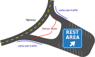
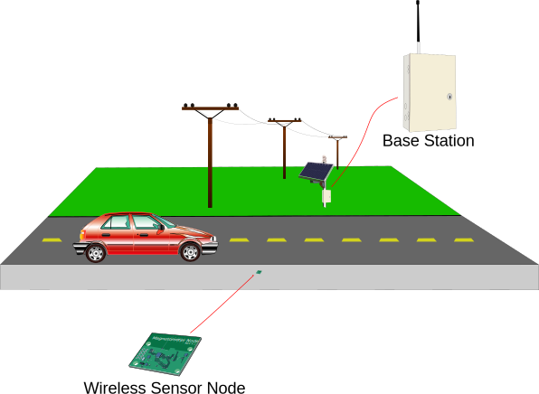

# Vehicle Re-Identification Using Dynamic Time Warping

## Overview

This project used dynamic time warping (DTW) in order to identify vehicle that entered a rest area and log information about usage, duration, and occupancy using the magnetic signatures of vehicles.

The overall approach to the system was to place wireless sensor nodes beneath the pavement of the entrance and exits of the rest area.

As vehicles enter, their magnetic signature and time of entry are recorded by a nearby base station. Whenever a vehicle leaves the rest area, another sensor transmits the magnetic signature to the base station which uses DTW to compare the signature of the departing vehicle with those in the database of vehicles that entered the rest area. The magnetic signature of the vehicle with the smallest difference from the departing vehicle is noted as a match and the entrance and exit times are logged in the system.

This system was developed as a  proof of concept and was able to achieve ~92% during limited testing. Additional accuracy could be possible using additional methods.

## The Code

First and foremost, this code depends on the [dynamic time warping library I made to familiarize myself with DTW](https://github.com/Tim-EE/Dynamic-Time-Warping).

The code in this repository was used to evaluate the accuracy of the data collected by setting up two sensors and having multiple cars driving over them many times to record magnetic signatures (`real_car_data.py`).

The main way to run the evaluations is to run:

    python runDTW.py -dataset real 1000 -v -n

This will run 1000 randomized trials with an existing database of 3 random magnetic signatures and, using DTW, attempt to select which vehicle it was that left the rest area.

The file, `rc_car_data.py`, contains example scenarios using remote-controlled cars with the intent of proving the concept before additional hardware and time was dedicated for full-scale testing. As such, `rc_car_data.py` will likely mean nothing to anyone other than me.
